# Bettmmwx

MiaoMiaoWuX 的独立主题集合。每个主题单独提供主控 CSS、TG Bot Mini App CSS、说明和资源。

## 预览

> 截图使用模拟数据：名称为演示用，IP 为 RFC 5737 / RFC 3849 文档地址段，流量与延迟为随机数值。

### Lumina 白金 / 黑金

| 桌面 · 首页（浅色） | 桌面 · 首页（深色） |
| --- | --- |
| 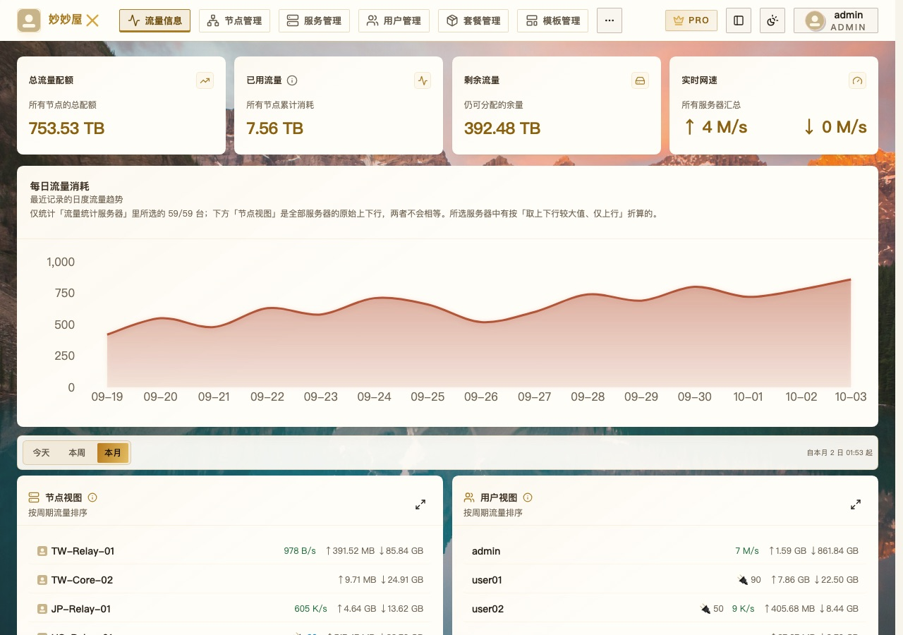 | 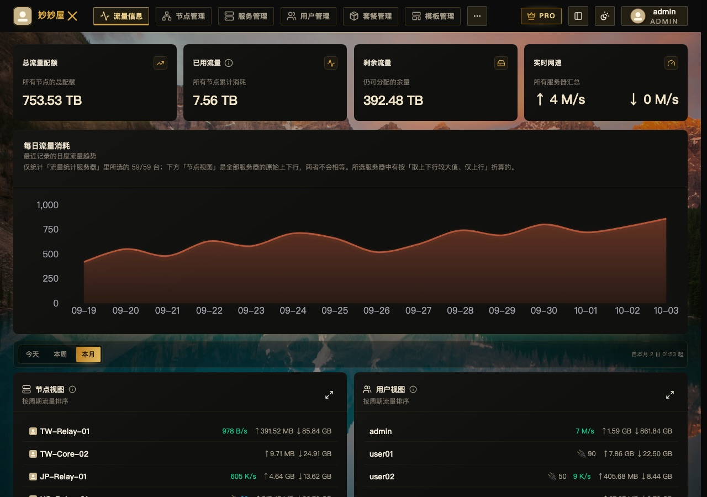 |

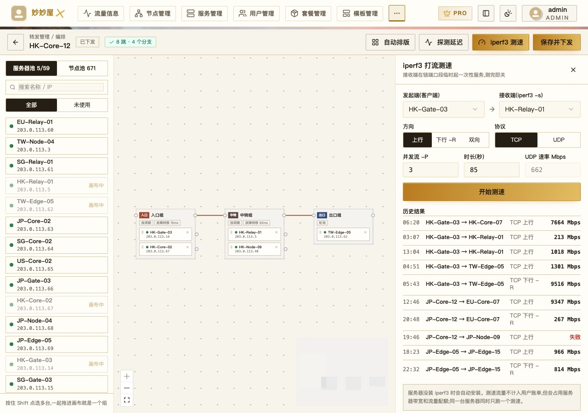

<p>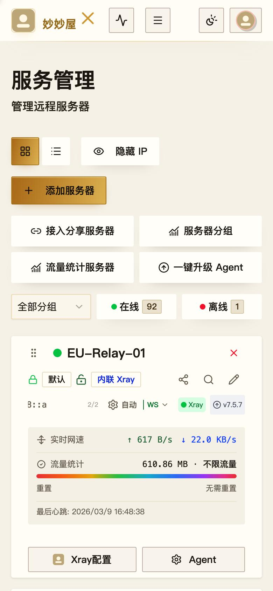 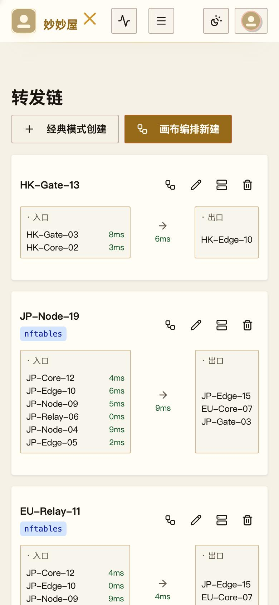</p>

### PaperMint 薄荷纸境

| 桌面 · 首页（浅色） | 桌面 · 首页（深色） |
| --- | --- |
| 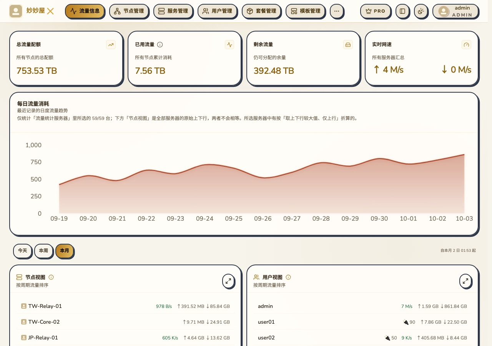 | 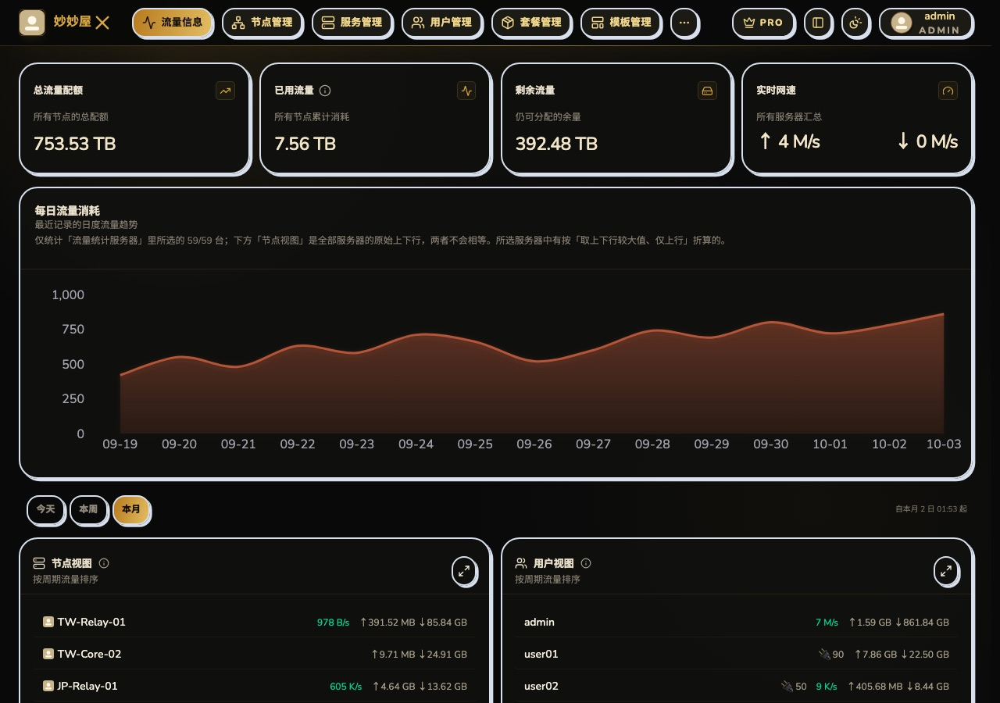 |

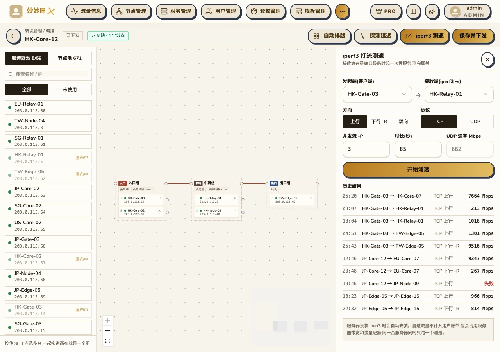

<p>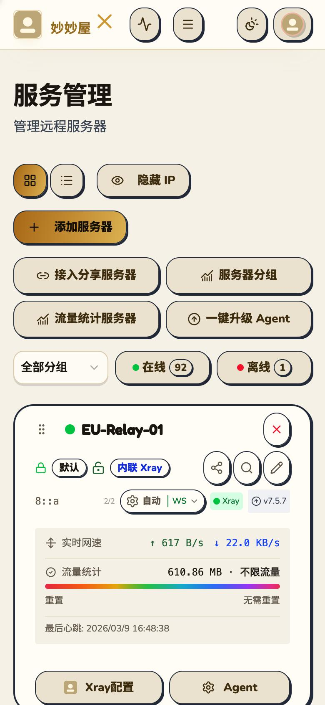 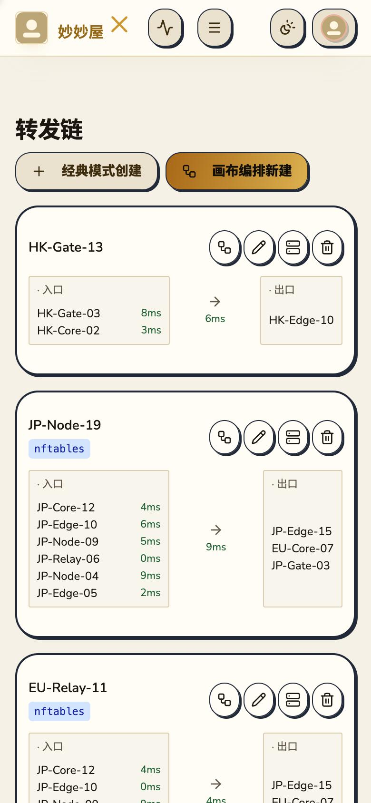</p>

### Claude Paper 陶纸

| 桌面 · 首页（浅色） | 桌面 · 首页（深色） |
| --- | --- |
| 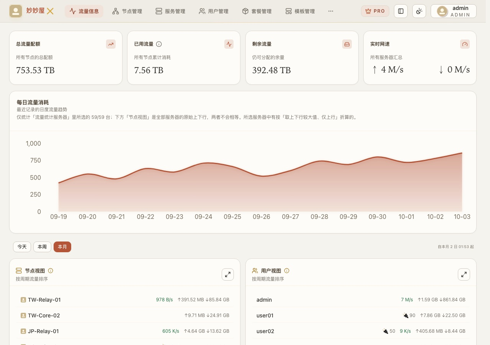 | 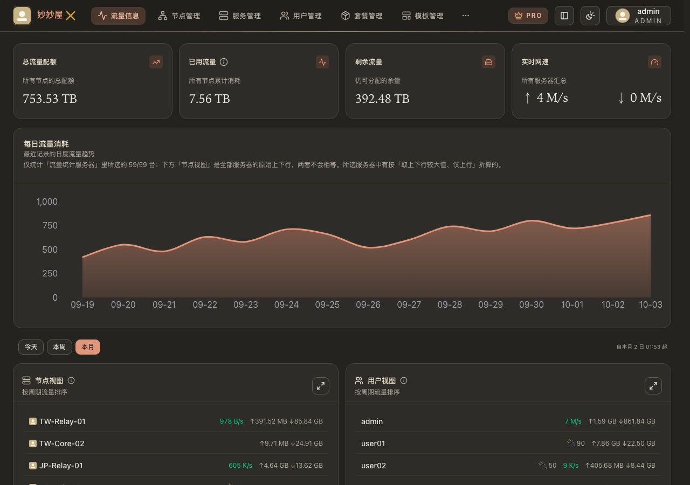 |

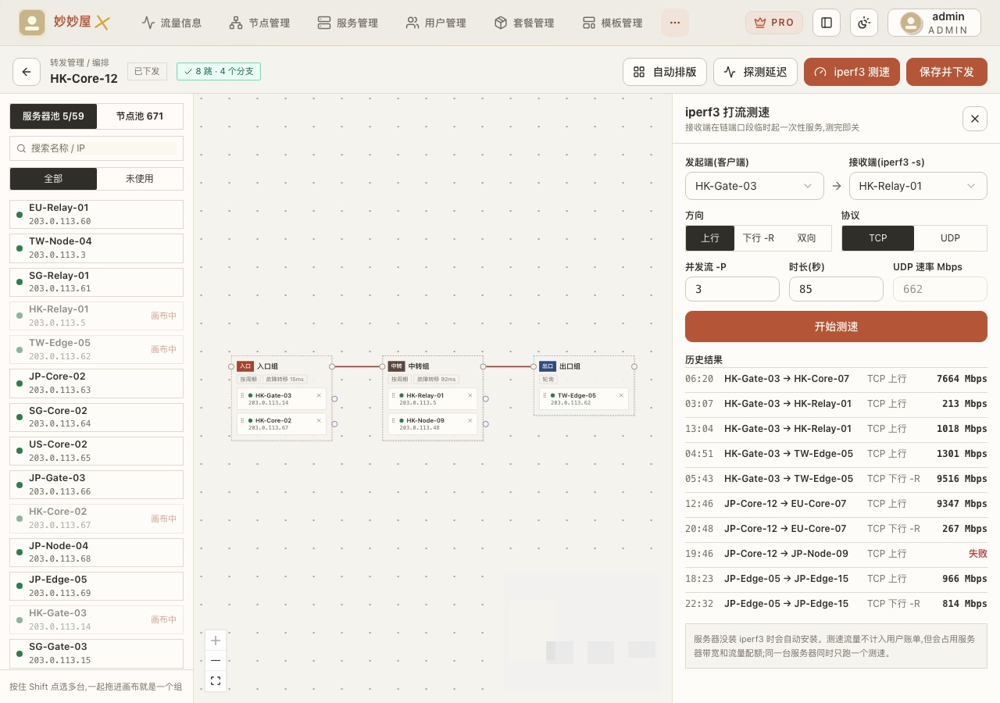

<p>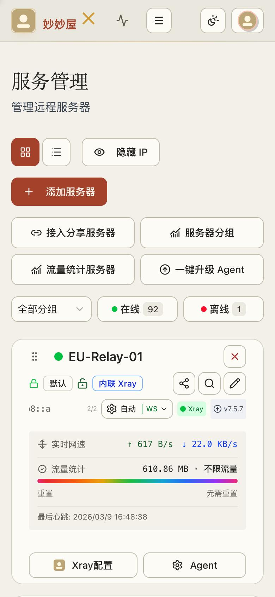 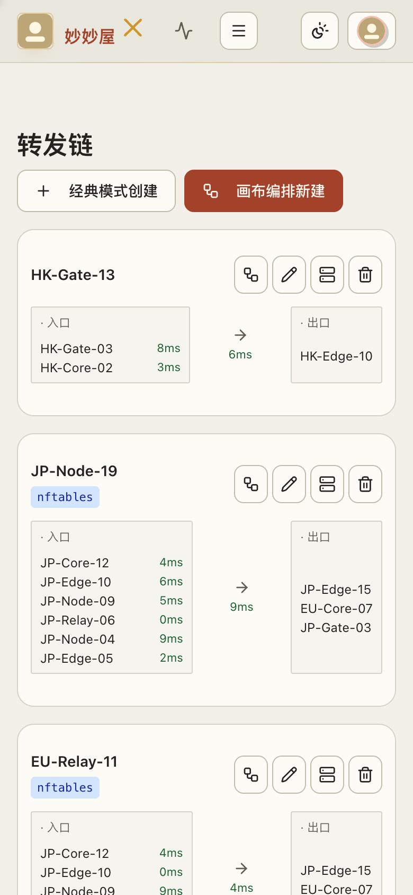</p>

## 主题

| 主题 | 主控 CSS | TG Bot Mini App CSS | 说明 |
| --- | --- | --- | --- |
| Lumina 白金 / 黑金 | [controller.css](themes/lumina/controller.css) · v2026.10.08-11 | [tgbot.css](themes/lumina/tgbot.css) · v2026.09.21-02 | [安装与配置](themes/lumina/README.md) |
| PaperMint 薄荷纸境 | [controller.css](themes/papermint/controller.css) · v2026.10.08-11 | [tgbot.css](themes/papermint/tgbot.css) · v2026.09.21-01 | [安装与配置](themes/papermint/README.md) |
| Claude Paper 陶纸 | [controller.css](themes/claude-paper/controller.css) · v2026.10.08-11 | [tgbot.css](themes/claude-paper/tgbot.css) · v2026.10.01-01 | [安装与配置](themes/claude-paper/README.md) |

- **Lumina**：暖金强调色，可选壁纸。
- **PaperMint**：圆角、描边、偏移硬阴影和粉彩辅助色。
- **Claude Paper 陶纸**：受 Claude 界面启发的非官方暖纸色主题，陶土橙与衬线标题。

各主题均支持浅色与深色，逐版更新记录见 [CHANGELOG.md](CHANGELOG.md)。

## 当前版本要点

- 适配主控 0.5.6-beta.6。
- **液态玻璃 / Meow 界面风格**：主题的配色、描边、圆角、阴影、字体等视觉设计让开，保留这两种风格的原生外观；布局、尺寸、溢出、换行、触控等细节修复仍然生效。Meow 深色改用陶纸深色底色，卡片与输入框加细描边；删除 CSS 中“Meow 深色可读性”一段可恢复原生。
- 关闭全站装饰动画与过渡（保留加载转圈），所有界面风格生效，减轻卡顿；删除 CSS 末尾“减少动画”一段可恢复。
- 卡片内的卡片（如手机节点管理的节点卡片）加描边区分；桌面节点表格选中行减淡。
- 需要支持 CSS 嵌套的浏览器：Chrome 112+、Safari / iOS 16.5+、Firefox 117+，更旧的浏览器整套主题不生效。

## 安装

先备份对应输入框里的旧 CSS，再打开需要的文件，点击 GitHub **Raw**，复制完整内容。

- **主控**：粘贴到「系统设置 → 外观 → 自定义 CSS」并保存、刷新；也可用该页的“从链接更新”填入 Raw 地址后保存。
- **TG Bot Mini App**：粘贴到「系统设置 → TG Bot → Mini App 自定义 CSS」并保存，再重新打开 Telegram 内的 Mini App。保存会随 Bot 重启生效，请选合适时间操作，不要改动 Token、管理员 ID 等其他配置。

每个输入框只用一套主题，不要合并 `controller.css` 与 `tgbot.css`，也不要叠加不同主题。TG Bot 主题只作用于 Mini App 网页，不改变 Telegram 聊天界面。

主控自定义 CSS 上限为 65,536 个 UTF-8 字节（不是字符数）。当前大小：Lumina 57,513、PaperMint 56,567、陶纸 55,453 字节。授权与版本要求见 [官方 CSS 文档](https://miaomiaowux.com/docs/custom-css/)，Mini App 说明见 [官方 TG Bot 文档](https://miaomiaowux.com/docs/tool-mmwx-tgbot/)。

## 配置

每个 CSS 文件开头的第一个 `:root` 集中放置可调参数（限宽、壁纸、按钮高度、水印等），各主题 README 逐项说明。更新时请完整替换 CSS，并把自己改过的参数重新填回。

- 服务卡片“自动”等模式菜单默认禁止点击，防误触；把 `--*-server-mode-pointer-events` 改为 `auto` 可恢复，键盘仍可操作。
- 保留在线、警告、危险操作的语义颜色，开关保留可辨识的滑块。
- 样式基于主控组件属性（`data-slot` 等）与 Mini App 的实际类名；主控升级改动结构后可能需要同步适配。

## 旧版主控备份

仍在使用 0.5.6-beta.6 之前主控（beta.4 及更早）的，请用各主题 `legacy/` 中的最后一版 v2026.10.06-02（原样备份，不再更新；TG Bot CSS 无需替换）：

| 主题 | 旧版主控 CSS |
| --- | --- |
| Lumina 白金 / 黑金 | [controller-v2026.10.06-02.css](themes/lumina/legacy/controller-v2026.10.06-02.css) |
| PaperMint 薄荷纸境 | [controller-v2026.10.06-02.css](themes/papermint/legacy/controller-v2026.10.06-02.css) |
| Claude Paper 陶纸 | [controller-v2026.10.06-02.css](themes/claude-paper/legacy/controller-v2026.10.06-02.css) |

## 目录结构

```text
themes/
├── README.md              # 主题目录约定
└── <theme-id>/            # lumina / papermint / claude-paper
    ├── README.md
    ├── controller.css     # 主控
    ├── tgbot.css          # TG Bot Mini App
    ├── screenshots/       # 模拟数据截图
    ├── legacy/            # 旧版主控（beta.6 之前）备份
    └── assets/            # 主题资源（Lumina 壁纸）
extensions/README.md       # 未来可选功能的扩展约定
assets/lumina-wallpaper.jpg  # 旧壁纸直链兼容副本
```

## 添加主题或功能

- 新主题放入 `themes/<theme-id>/`，按 [主题约定](themes/README.md) 独立提供各端文件和说明；可选功能放入 `extensions/<feature-id>/`，见 [扩展约定](extensions/README.md)。
- 主题应能独立使用，不依赖其他主题，也不用远程 `@import` 拼接必需功能。
- CSS 修改需更新头部版本与日期，格式为 `vYYYY.MM.DD-NN`。

## 说明

- 仓库只含样式、图片与说明，不含主控地址、Bot Token、账号或许可证数据，不会自动安装或改变任何业务配置。
- Lumina 壁纸通过 GitHub Raw 加载并锁定提交版本；PaperMint 主控使用 Google Fonts，加载失败时回退系统字体。替换图片或字体时请确保有使用权限。
- 早期根目录的 `mmwx-lumina-platinum-gold.css`、`mmwx-papermint.css` 已迁入 `themes/lumina/controller.css`、`themes/papermint/controller.css`，已粘贴到主控的 CSS 不受影响。
- Mini App 样式用静态样例验证布局，未覆盖 Telegram 客户端中的登录与业务流程；不要为预览开启生产环境的调试认证。
