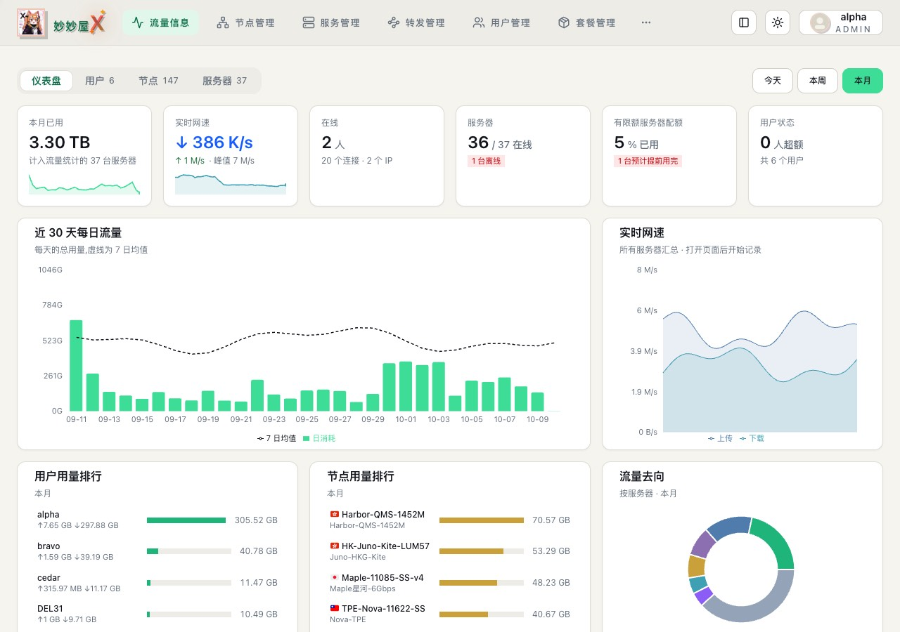
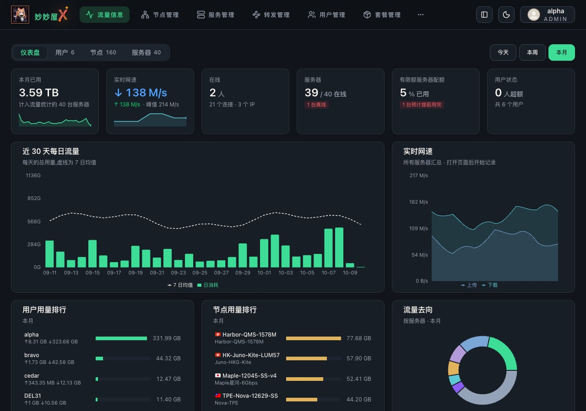
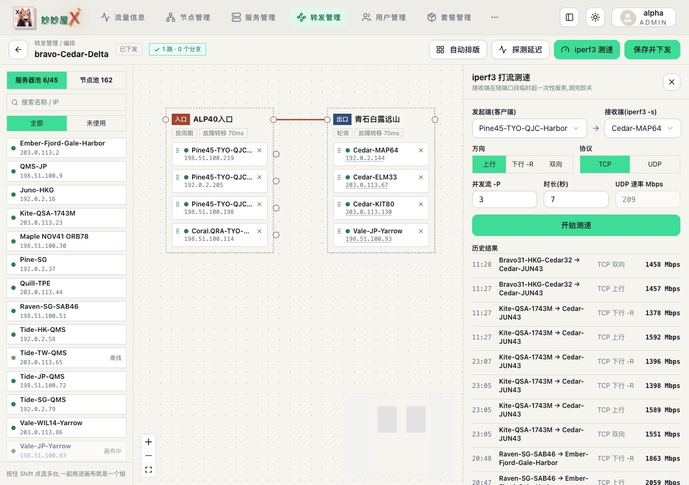
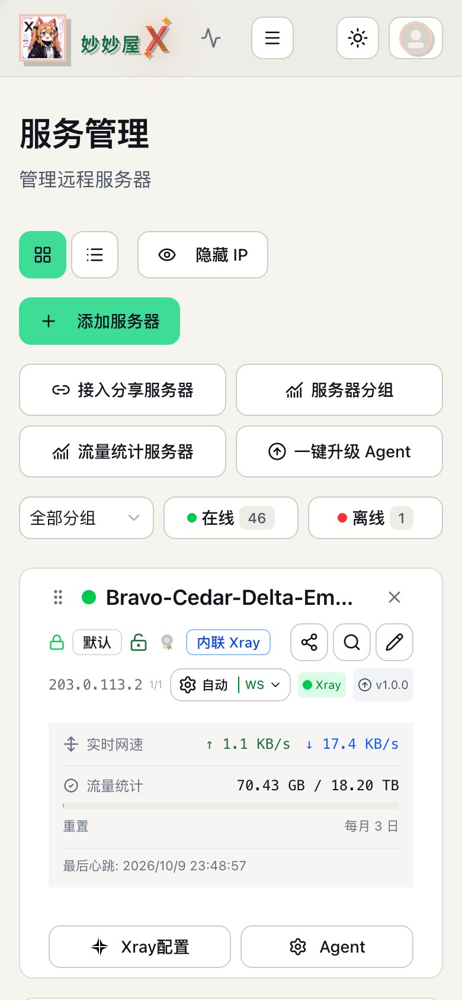
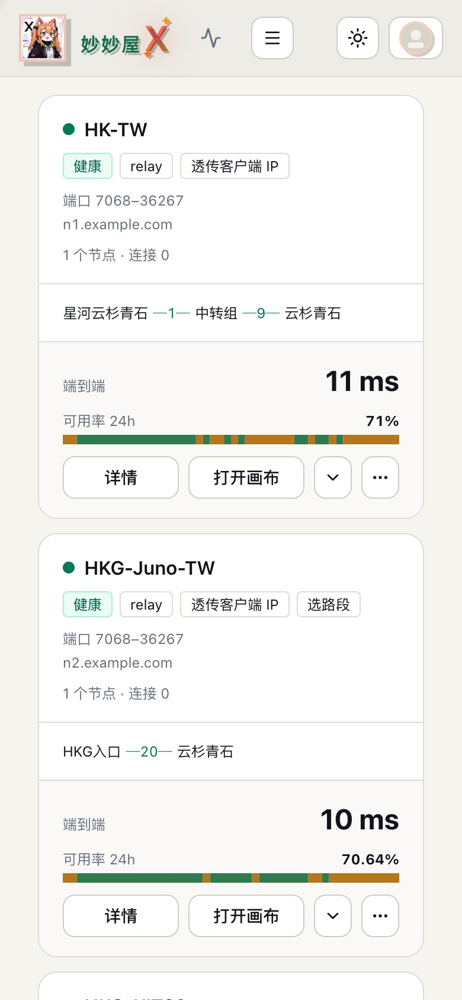

# Ink Mint · 墨薄荷

暖纸白 / 蓝墨黑底色、薄荷绿强调的主控与 TG Bot Mini App 主题：几何无衬线标题，IP、延迟等数据用等宽字体，细描边、少阴影。配色思路参考 nodecloak.com 的明暗两套界面；非官方，不使用其标识、字体或图片素材。

- [controller.css](controller.css)：主控完整样式，`v2026.10.11-02`，适用于主控 0.5.6-beta.6 及以后（已核对 beta.9）。
- [tgbot.css](tgbot.css)：TG Bot Mini App 完整样式，`v2026.10.11-01`；不要与主控文件混用。
- 独立文件，不依赖其他主题，不加载远程字体、图片或脚本。

## 预览

> 截图使用模拟数据：节点、链路与用户名称为演示用名称，IP 使用 RFC 5737 / RFC 3849 文档地址段，域名为 example.com，流量、延迟、计数与图表曲线均为合成数值，Logo 以外的头像为占位图，不含任何真实服务器信息。

| 桌面 · 首页（浅色） | 桌面 · 首页（深色） |
| --- | --- |
|  |  |

 

## 安装

备份对应输入框里的旧 CSS，每个输入框只完整粘贴一套主题，不要叠加。

- **主控**：将 `controller.css` 完整替换到「系统设置 → 外观 → 自定义 CSS」，保存后刷新；也可用该页的“从链接更新”填入 Raw 地址。
- **TG Bot Mini App**：将 `tgbot.css` 完整替换到「系统设置 → TG Bot → Mini App 自定义 CSS」，保存后重新打开 Telegram 内的 Mini App。保存可能触发 Bot 重启，请选合适时机；不要改动 Token、管理员 ID 等其他配置。

两端样式分别保存，更新主控 CSS 不会自动更新 Mini App。Mini App 主题不改变 Telegram 原生聊天界面。

主控 CSS 完整文件 54,606 个 UTF-8 字节，低于 65,536 字节上限。需要支持 CSS 嵌套的浏览器：Chrome 112+、Safari / iOS 16.5+、Firefox 117+。

## 界面风格与深浅色

- 跟随主控的浅色 / 深色切换。
- 妙妙屋、高级黑金、扁平、动漫等界面风格统一使用墨薄荷配色；危险、警告、在线等状态保留语义色。
- **液态玻璃 / Meow**：配色、描边、圆角、阴影、字体等视觉设计让开，保留这两种风格的原生外观；布局、尺寸、溢出、换行、触控等细节修复仍然生效。Meow 深色改用较亮的暖炭底色，卡片与输入框加细描边；删除 CSS 中“Meow 深色可读性”一段可恢复原生。
- 选中的分段按钮（首页今天 / 本周 / 本月、转发链路线 / 紧凑、画布页上行 / 下行、TCP / UDP、服务器池 / 节点池等）使用薄荷绿底、墨色字。
- 主控各处的深绿统一为薄荷绿：转发链可用性条与拓扑线（`--fwd-ok`）、图表第 1 色、状态圆点与细条、绿色图标，以及首页用户 / 节点用量排行进度条；浅绿底徽标与延迟格子改为薄荷浅底。绿色文字仍用深绿，保证浅色下可读。
- 转发链详情“路线与成员”的组名不再被后面的说明挤成两行；Mini App 的“有效期”等分段按钮按文字宽度排布、不换行（适配主控 beta.9）。
- 关闭全站装饰动画与过渡（保留加载转圈），所有界面风格生效；删除 CSS 末尾“减少动画”一段可恢复。

## 主控顶部配置

可调参数集中在 `controller.css` 第一个 `:root`，均以 `--ink-*` 命名。更新时请完整替换 CSS，再把自己改过的参数填回。

| 参数 | 默认值 / 用途 |
| --- | --- |
| `--ink-content-max-width` | `1440px`；`100%` 不限宽 |
| `--ink-content-gutter` | `24px`，640px 及以上的页面两侧内边距 |
| `--ink-card-radius` / `--ink-control-radius` | `12px` / `10px`，卡片与按钮、输入框圆角 |
| `--ink-light-page` / `--ink-dark-page` | 深浅页面底色 `#f6f4ef` / `#11151b` |
| `--ink-light-surface` / `--ink-dark-surface` | 深浅面板底色 `#ffffff` / `#181e26` |
| `--ink-light-ink` / `--ink-dark-ink` | 深浅正文颜色 |
| `--ink-light-accent` / `--ink-dark-accent` | 主按钮等填充的强调色，默认薄荷绿 `#3ddc97` |
| `--ink-light-accent-text` / `--ink-dark-accent-text` | 绿色文字颜色；浅色用深绿 `#0b6e48` 保证可读 |
| `--ink-body-font` | 本地无衬线正文字体 |
| `--ink-heading-font` | 页面与弹窗标题字体（Avenir Next 等几何无衬线，字重 650） |
| `--ink-mono-font` | IP、延迟等数据的等宽字体 |
| `--ink-mobile-card-shadow` | 手机卡片阴影，默认 `none` |
| `--ink-server-mode-pointer-events` | 服务卡片“自动”等模式菜单防误触，`none` 禁止点击（默认），`auto` 恢复；键盘仍可操作 |
| `--ink-mobile-canvas-pan-pointer-events` | 767px 以下画布空白区：`none` 滑动页面（默认）；开启主控“拖动画布”按钮后可直接拖动 |
| `--ink-mobile-canvas-pan-strip` | 旧版主控用的画布平移栏，默认 `none` 隐藏，旧版主控可改 `flex` |

强调色是按钮底色，按钮文字固定为墨色；改强调色时请同时核对按钮文字对比度。

## Mini App 顶部配置

参数集中在 `tgbot.css` 第一个 `:root`，使用独立的 `--ink-mini-*`，不依赖主控变量。

| 参数 | 默认值 / 用途 |
| --- | --- |
| `--ink-mini-content-max-width` | `900px`；`100%` 不限宽 |
| `--ink-mini-button-height` | `40px`，普通按钮最小高度，不改变开关尺寸 |
| `--ink-mini-card-radius` / `--ink-mini-control-radius` | `12px` / `10px` |
| `--ink-mini-light-page` / `--ink-mini-dark-page` | 深浅页面底色 |
| `--ink-mini-light-surface` / `--ink-mini-dark-surface` | 深浅卡片、输入框及导航底色 |
| `--ink-mini-light-ink` / `--ink-mini-dark-ink` | 深浅正文颜色 |
| `--ink-mini-light-accent` / `--ink-mini-dark-accent` | 深浅强调色（按钮、进度条、开关） |
| `--ink-mini-light-accent-text` / `--ink-mini-dark-accent-text` | 强调色按钮上的文字颜色 |
| `--ink-mini-body-font` / `--ink-mini-heading-font` | 本地正文字体 / 统计数字字体 |

Mini App 使用实色底面，不加载壁纸、在线字体或背景模糊。选中的分段为卡片底配深绿字，底部导航选中项为浅绿底配深绿字，不使用整块高饱和背景；开关保留白色滑块，危险操作为红色，未知状态保持中性。保留 `.hide`、禁用态、键盘焦点和底部安全区域。

## 说明与验证

- 由陶纸主题派生，沿用其全部布局与细节修复（手机服务管理两列按钮、转发链卡片两行操作、画布手机布局、二级窗口滚动、批量操作栏等分整行等），只替换配色、字体与圆角，并去掉陶纸专属的暖色色阶映射，主控原生的状态色保持不变。
- 主控版曾作为线上自定义 CSS 配置部署预览；截图取自线上页面的脱敏快照（名称、IP、域名、数值在浏览器内替换后导出），在本机注入本文件渲染，四套主题的画布分段按钮选中态另在深浅色下逐一核对。
- Mini App 版用无业务数据的静态样例检查：320 / 375 / 430 / 768px、深浅色无横向溢出，按钮、分段、开关、徽标与导航对比度正常。未在 Telegram 客户端中验证认证、兑换、订阅或服务器控制流程。
- 主控升级可能改变组件结构；样式使用 `:has()`、`color-mix()`、CSS 嵌套等现代特性。
